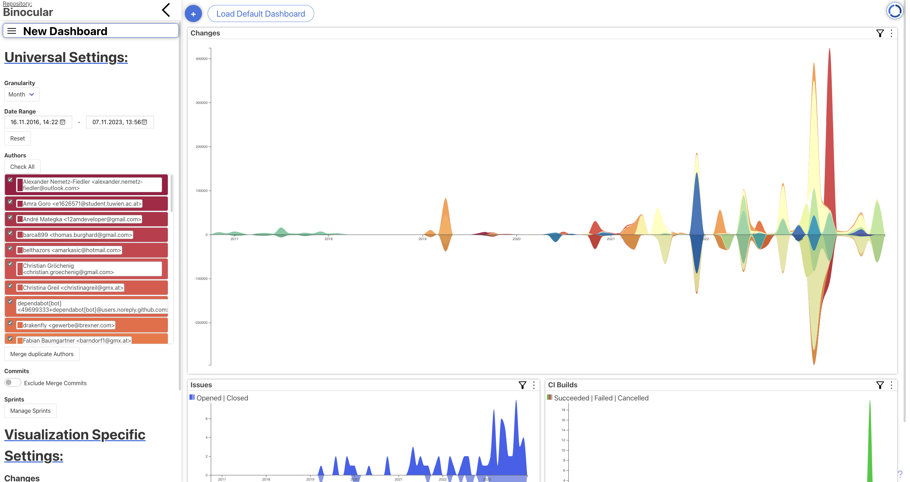

Binocular
=====

[](https://github.com/INSO-TUWien/Binocular/actions/workflows/build-offline.yml)
[](https://github.com/INSO-TUWien/Binocular/actions/workflows/eslint.yml)
[](https://github.com/INSO-TUWien/Binocular/actions/workflows/build-docker.yml)



Binocular is a tool for visualizing data from various software-engineering
tools. It works as a command-line tool run from a git-repository. When
run, Binocular will gather data from the repository and the GitHub or GitLab API
and persist it to a configured ArangoDB instance.

Binocular then hosts interactive visualizations about the gathered data
via a web-interface.

## Preview
- [Demo Page](https://inso-tuwien.github.io/Binocular/)
- [Screenshots](docs/PREVIEW.md)

## Dependencies

* node.js 20 LTS
* ArangoDB (tested with 3.11.3)

## Installation

Binocular is not yet published on the npm registry. To install it, you
should clone this repository and then link it:

``` shell
$ git clone https://github.com/INSO-TUWien/Binocular.git
$ cd Binocular
/Binocular $ npm install # <- this will install the dependencies Binocular needs
/Binocular $ npm link    # <- this will make the `Binocular` executable available in your $PATH
```

### Configuration

As Binocular needs to access an ArangoDB instance (run `binocular -sdb` or `binocular --setup-db` to access the ArangoDB download page),
you have to configure the database connection before you can use Binocular. This can be done in
the global Binocular configuration file `~/.binocularrc`. Additionally, the
configuration file also stores authentication credentials for the used
APIs. The configuration file is read by the [rc
module](https://www.npmjs.com/package/rc). Check its documentation to
see the supported formats. For the purpose of this README, we'll use
json.

For simpler configuration there is also a configuration assistant avaliable
by executing `binocular -sc` or `binocular --setup-config`.
It will ask you some questions about the repository and generate the config file for you.

#### Configuration options

- `gitlab`: Object holding gitlab configuration options
  - `url`: The URL to the GitLab-Instance you want to connect to. Use the
         base-url, not the API-URL (see the example)!
  - `project`: 
  - `token`: The personal access token generated by your GitLab user to
            use for authentication (see
            https://docs.gitlab.com/ee/user/profile/personal_access_tokens.html)
- `github`: Object holding GitHub configuration options
  - `auth`: Can hold any options that the [github npm-module] can take, check its documentation.
- `arango`: Object holding arangodb-configuration
  - `host`: Hostname
  - `port`: Port
  - `user`: username
  - `password`: password
- `travis`: Object holding travis-ci configuration options
  - `token`: (_**Optional for public repositories**_) holds the different access tokens for public and private repositories (https://blog.travis-ci.com/2013-01-28-token-token-token)
    - `access`: Access tokens are used to interact with the Travis API
    - `travis`:  If you want to display the status image for a private repository.
  - `timeout`: (_**Optional**_) set the timeout to cancel api request  
- `indexers`: (_**Optional**_) Object holding indexer configuration options.
              Should only be used if the repository could not detect the indexers automatically.
  - `its`: Holds the name of the issue tracking system indexer, for instance, GitLab or GitHub
  - `ci`: Since the CI indexer importer is searching for the corresponding file in the repository, it can be necessary to specify the
          correct indexer like, for example, GitLab or GitHub.
- `fileRenameBranches`: Array containing all branches for which file renames should be indexed. Additions to files that were later renamed are therefore shown in the visualizations. Without tracking renames, addition numbers for authors may be inaccurate. Comes with a performance penalty at index time.
- `ignoreFiles`: Array containing files/directories ignored by the indexer. Useful for large files (like `package-lock.json`) or irrelevant directories. Wildcards (*) are supported, see example below.
         
A sample configuration file looks like this:

```json
{
  "gitlab": {
    "url": "https://gitlab.com/",
    "token": "YOUR_GITLAB_API_TOKEN"
  },
  "github": {
    "auth": {
      "type": "basic",
      "username": "YOUR_GITHUB_USER",
      "token": "YOUR_GITHUB_OAUTH_TOKEN"
    }
  },
  "arango": {
    "host": "127.0.0.1",
    "port": 8529,
    "user": "YOUR_ARANGODB_USER",
    "password": "YOUR_ARANGODB_PASSWORD"
  },
  "indexers": {
    "its": "github",
    "ci": "github" 
  },
  "fileRenameBranches": [
        "main",
        "develop"
    ],
    "ignoreFiles": [
        "*package-lock.json",
        "*docs/*"
    ]
}
```


You may override configuration options for specific projects by
placing another `.binocularrc` file in the project's root directory.

You may also modify a config to the `gitlab.json` file in `./binocular-frontend/config`. This file sets
the GitLab API settings for the CodeHotspots-visualization for
offline execution. This is only necessary if you want to automatically
set those options within, for example, a GitLab pipeline.


#### Configuration options
- `server`: GitLab API server url
- `projectId`: GitLab project ID

A sample configuration file looks like this:
``` json
{
  "server":"GITLAB_API_URL",
  "projectId":"GITLAB_PROJECT_ID"
}
```

## Usage

To run Binocular, simply execute `binocular` or `binocular -rc` or `binocular --run-concurrently` from the repository you want to
run Binocular on (you can try it on the Binocular-repo itself!). Binocular will
try to guess reasonable defaults for configuration based on your
`.git/config`. You can access the webinterface of binocular though port 8080. 

For testing, you can also execute Binocular directly in the Binocular
Dictionary by running the command:
``` shell
npm run dev
```
If you run Windows (does not support chaining of commands) you
should use the command:
``` shell
npm run dev-concurrently
```
This will start both the node backend and webpack frontend server
for the Binocular dictionary and mine it. If you run Binocular for the
first time, it will show webpack errors for missing JSON files. This
happens because to build the frontend it needs an export of the db to
build so that it can fall back to run without the backend. This
is necessary when binocular gets executed within a GitLab
pipeline/GitHub action. Those errors aren't a problem because when
you execute Binocular for the first time and the indexers are finished, it
will create the db export by itself and place it into the correct
folder. After the exported JSON files of the db are available, it is
possible to build an offline executable version of Binocular by
executing the command
``` shell
npm run build
```
This will create an html and js file in the dist folder that can be
opened without the backend running. It is also possible
to place the exported JSON files of a different mining job under `./binocular-frontend/db_export/` and build the frontend. (not
all features will be available in the offline build)

For more information check `binocular -h`

## Contributing

**:warning:Binocular is currently in a transition state from javascript to typescript.
Although it is compatible with both javascript and typescript components, new visualizations
should be implemented in typescript.
Please refer to the change visualization/visualization Component
if you are unsure how to implement a visualization in typescript.:warning:**

For an explanation of Binocular's architecture, please see the [Contribution
guidelines for this project](docs/CONTRIBUTING.md)

For an overview of the database collections and connections Binocular creates,
please see the [database documentation](docs/DATABASE.md)
