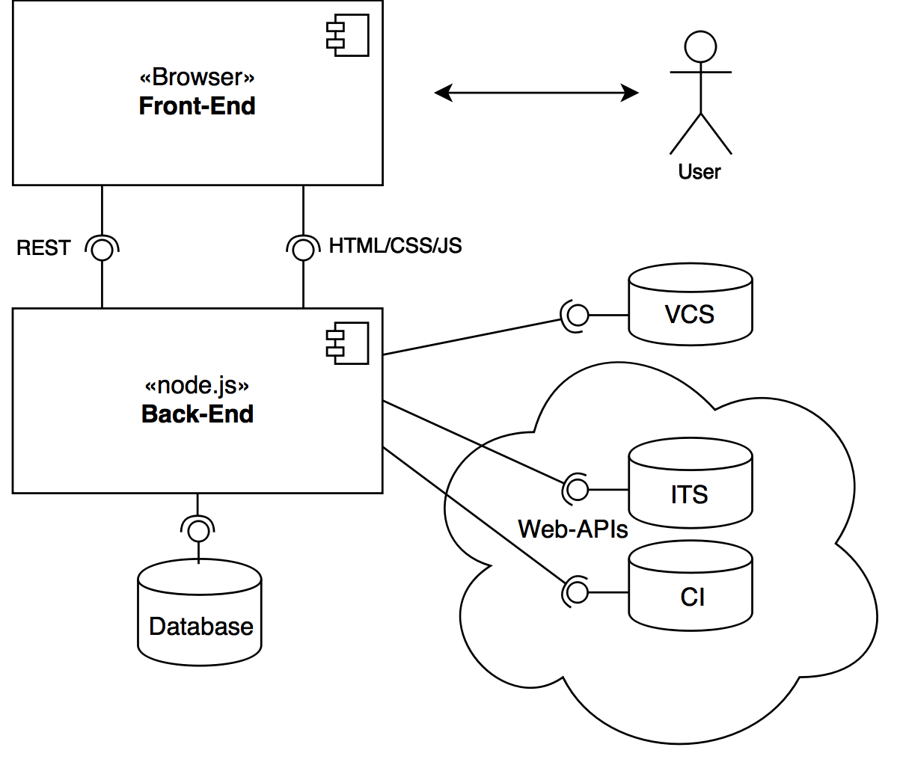

Contributing to pupil
=====================

***Should you wish to work on pupil, please use
[prettier](https://github.com/prettier/prettier) to keep your code
formatted!***

This document aims to give a general overview of pupil's internal
architecture.

Pupil is designed as a node.js command-line application that hosts a
React/Redux-based Front-End. Pupil is generally split into three components:

- A back-end responsible for gathering data from the various
  data-sources
- A front-end to display visualizations from the data
- A GraphQL-interface that is mounted into ArangoDB that allows the
  Front-End to easily query data from the back-end



Technically, the front-end does not access the GraphQL-interface
directly, but uses a proxy that the back-end provides to circumvent
CORS-issues.


The source-code is organized similarly:

```
pupil
├── foxx     # Holds the foxx-service that is the GraphQL-interface
├── lib      # Holds the back-end
└── ui       # Holds the front-end
```


## Back-End

The back-end is a pretty straightforward node.js application. It is
responsible for gathering data and uses express to host the front-end.

The data gathering is done by a type of component called indexer. You
can see the indexers in the `lib/indexers` directory:

```

lib/indexers
├── BaseGitLabIndexer.js    # Basic indexer for accessing GitLab-Data
├── ci                      # CI-specific indexers
│   ├── GitLabCIIndexer.js  # Indexer for GitLab-CI
│   ├── ...                 # (Additional CI-indexers could be added here)
│   └── index.js
├── its                     # ITS-specific indexers
│   ├── GitHubIndexer.js    # Indexer for GitHub
│   ├── GitLabITSIndexer.js # Indexer for GitLab
│   ├── ...                 # (Additional ITS-indexers could be added here)
│   └── index.js
└── vcs
    ├── GitIndexer.js       # Indexer for git
│   ├── ...                 # (Additional VCS-indexers could be added here)
    └── index.js
```

## GraphQL-Interface

The GraphQl interface is hosted as an ArangoDB-FOXX-service which is
automatically zipped and installed at startup into the database. It
enables querying the database easiliy through GraphQl. A very useful
tool is the GraphiQl-interface exposed by it, which allows developers
to interactively query the service. Once the service is installed in
the database, it can be accessed by pointing your browser to
`http://ARANGO_HOST:ARANGO_PORT/pupil-PROJECT_NAME/pupil-ql`, e.g.
http://localhost:8529/_db/pupil-pupil/pupil-ql.

## Front-End

The front-end is a redux-backed react application that heavily relies
on D3 to do its work:

```
ui
├── index.html                    # Main entry point
└── src
   ├── components                 # Holds general components used everywhere in the app
   ├── index.js                   # Main JS-entry-point
   ├── reducers                   # Holds general reducers
   ├── sagas                      # Holds general sagas
   ├── utils                      # Utility functions
   └── visualizations             # Each visualization is a directory here, with its own reducers and sagas
       ├── code-ownership-river
       │   ├── chart              # Main chart component
       │   ├── config.js          # Main config component (shown in the sidebar)
       │   ├── help.js            # Component shown in the help-section
       │   ├── index.js           # main entry point for the component, bundles everything together
       │   ├── reducers           # Reducers for the visualization
       │   │   ├── config.js      # Configuration-related reducers
       │   │   ├── data.js        # Data-related reducers
       │   │   └── index.js
       │   ├── sagas              # Sagas/Actions for the visualization
       │   └── styles.scss        # Styles for the visualization
       ├── hotspot-dials
       │   ├── chart.js
       │   ├── help.js
       │   ├── reducers
       │   │   ├── config.js
       │   │   ├── data.js
       │   │   └── index.js
       │   ├── sagas
       │   │   └── index.js
       │   └── styles.scss
       └── issue-impact
           ├── chart.js
           ├── config.js
           ├── help.js
           ├── index.js
           ├── reducers
           │   ├── config.js
           │   ├── data.js
           │   └── index.js
           ├── sagas
           │   └── index.js
           └── styles.scss
```

To add another visualization, check the source code of the existing ones.

## Explanation of used Libraries (For newbies, from a newbie)
If you wish to add another visualization, the amount of used libraries/frameworks can be a little daunting.
I will try to explain the libraries that seemed the most important to me, and that were the biggest hurdle.

### React
The User Interface is built with react.js, a framework where you can define Components that you can write once and re-use as many times as you want.
Each component has a render() method, where you can return HTML-Elements or other React-Elements in so-called JSX-Syntax (basically returning HTML plaintext in javascript).
Basically, if you define a Component called MyComponent, you can later use it by typing <MyComponent/> in the return statement of a render() method.
You can also pass values to a component using properties (props) like you would in HTML: <MyComponent prop1="Hello"/>. You can even compute things like so: <MyComponent prop1={1+1}/>
Each element also has a local state where you can save whatever you want.
To take a look at react in detail, please check out https://reactjs.org/docs/getting-started.html
I found the "Guide to Main Concepts" to be more helpful than the practical tutorial.
React is the best place to start in order to understand the structure of this application.

### Redux
The state of the application is managed with Redux. It is used for things like the state of a UI element, but also e.g. fetching data from the database.
The state is stored in a certalized store element and split up into smaller chunks for each component, using something called "reducers".
The state can only be changed using "actions" that you define, which you need to dispatch using a method (called dispatch()).
https://redux.js.org/

### Redux-Saga
For asynchronous calls, like getting stuff from a database, redux-saga is used.
It basically works like a second thread that executes redux actions every time something happens (a redux action) or every X seconds.
https://github.com/redux-saga/redux-saga

### React-Redux
React-Redux has some functions that help with putting React and Redux together. (mapStateToprops, mapDispatchToProps, connect)
https://react-redux.js.org/

### D3
D3 is a data driven library with powerful functions to help you manipulated the DOM of the HTML.
You can, among other things, build graphs with it, which is used for these visualizations.
You will notice that in most tutorials, d3 is used for everything. However, react is responsible for most of the DOM here, so you will need something to link the two.
This is done by using refs:

```
	d3.select(this.ref).doSomething();

	<svg ref={this.ref}/>

```

CAUTION: You can only use d3 select calls once the React component is mounted in the DOM, a.k.a. actually rendered in the webpage.
The react method componentDidMount() is called once the component is mounted into the DOM.
CAUTION(2): The different versions of d3 have different API calls, some things might work in Version 3 that won't work in Version 4.
As of September 2019, v4.4 is used. I have pasted a link to the documentation of that version below. When you google stuff, always include v4 in the query.
https://devdocs.io/d3~4/
D3 Website: https://d3js.org/
You can try out d3 examples here: https://blockbuilder.org/

### ArangoDB
ArangoDB is a document based Database that has no strict schema. I recommend accessing the web interface to check out what is saved by this program.
It will become clear pretty quickly how the data is saved.
The default for the web interface is http://localhost:8529/
Please make sure ArangoDB is running.
https://www.arangodb.com/arangodb-training-center/
To see how content is queried, please see "GraphQL-Interface" above.
