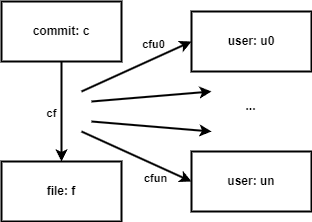
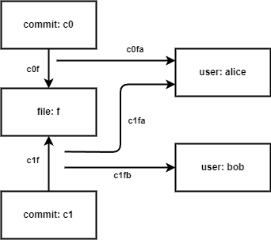

# Database Scheme

This document lists all collections and connections of the ArangoDB Database used by Binocular.
Complicated connections such as `branches-files-files` and `commits-files-users` are explained in detail.

* [Collections](#collections)
  * [accounts](#accounts)
  * [branches](#branches)
  * [builds](#builds)
  * [commits](#commits)
  * [files](#files)
  * [issues](#issues)
  * [mergeRequests](#mergerequests)
  * [milestones](#milestones)
  * [modules](#modules)
  * [notes](#notes)
  * [users](#users)
* [Connections](#connections)
  * [branches-files](#branches-files)
  * [branches-files-files](#branches-files-files)
    * [Attributes](#attributes)
    * [Example](#example)
    * [Details](#details)
  * [commits-builds](#commits-builds)
  * [commits-commits](#commits-commits)
  * [commits-files](#commits-files)
  * [commits-files-users](#commits-files-users)
    * [Attributes](#attributes-1)
    * [Example](#example-1)
    * [Details](#details-1)
  * [commits-modules](#commits-modules)
  * [commits-users](#commits-users)
  * [issues-accounts](#issues-accounts)
  * [issues-commits](#issues-commits)
  * [issues-milestones](#issues-milestones)
  * [issues-notes](#issues-notes)
  * [mergeRequests-accounts](#mergerequests-accounts)
  * [mergeRequests-milestones](#mergerequests-milestones)
  * [mergeRequests-notes](#mergerequests-notes)
  * [issues-users](#issues-users)
  * [modules-files](#modules-files)
  * [modules-modules](#modules-modules)
  * [notes-accounts](#notes-accounts)


## Collections

### accounts

Accounts from platforms like GitHub or GitLab.

| attribute name | type           | details                    |
|----------------|----------------|----------------------------|
| `platform`     | string         | e.g. GitHub                |
| `login`        | string         | username                   |
| `name`         | string \| null | full name                  |
| `avatarUrl`    | string         | url of the profile picture |
| `url`          | string         | url of the profile         |

### branches

All branches that exist in the project at the time of indexing.
Deleted branches are not indexed.

| attribute name      | type    | details                                                                                                                                                                                                                                                                                        |
|---------------------|---------|------------------------------------------------------------------------------------------------------------------------------------------------------------------------------------------------------------------------------------------------------------------------------------------------|
| `id`                | string  | internal ArangoDB key                                                                                                                                                                                                                                                                          |
| `branch`            | string  | Name of the branch                                                                                                                                                                                                                                                                             |
| `active`            | boolean | If this is the checked-out branch at the time of indexing.<br/> Which branches track file renames is controlled by the `fileRenameBranches` array in the `.binocularrc` file.<br/> For more information, check the documentation of the [branches-files-files connection](#branches-files-files) |
| `tracksFileRenames` | boolean | If the indexer tracked file-renames on this branch                                                                                                                                                                                                                                            |
| `latestCommit`      | string  | The hash of the last commit of this branch                                                                                                                                                                                                                                                     |

### builds

Builds by the CI system.

| attribute name | type                       | details                                                    |
|----------------|----------------------------|------------------------------------------------------------|
| `id`           | string                     | internal ArangoDB key                                      |
| `committedAt`  | string (timestamp)         |                                                            |
| `createdAt`    | string (timestamp)         |                                                            |
| `duration`     | number                     | duration in seconds                                        |
| `finishedAt`   | string (timestamp)         |                                                            |
| `jobs`         | Array\[[Job](#job-object)] | see definition below                                       |
| `startedAt`    | string (timestamp)         |                                                            |
| `status`       | string                     |                                                            |
| `tag`          | string                     | first line of the commit message that triggered this build |
| `updatedAt`    | string (timestamp)         |                                                            |
| `user`         | string                     | user that triggered this build                             |
| `userFullName` | string                     |                                                            |
| `webUrl`       | string                     | link to platform                                           |

#### Job Object

| attribute name | type               | details                                |
|----------------|--------------------|----------------------------------------|
| `id`           | number             | internal GitHub/GitLab id of the job   |
| `name`         | string             | name of the user who triggered the job |
| `status`       | string             |                                        |
| `stage`        | string             |                                        |
| `createdAt`    | string (timestamp) |                                        |
| `finishedAt`   | string (timestamp) |                                        |
| `webUrl`       | string             | link to GitHub/GitLab                  |

### commits

| attribute name | type                          | details                                               |
|----------------|-------------------------------|-------------------------------------------------------|
| `sha`          | string                        | sha hash of the commit. Also used as the ArangoDB key |
| `date`         | string (timestamp)            |                                                       |
| `message`      | string                        | commit message                                        |
| `webUrl`       | string                        | link to GitHub/Lab                                    |
| `branch`       | string                        | branch this commit currently belongs to.              |
| `stats`        | [Stats](#stats-object) Object | see below                                             |

#### Stats Object

| attribute name | type   | details                                |
|----------------|--------|----------------------------------------|
| `additions`    | number | number of lines added in this commit   |
| `deletions`    | number | number of lines deleted in this commit |                                                       |

### files

All files that ever existed in the project.
Also includes deleted files.
Note that renaming files technically deletes the old file and creates a new file with the new path.

| attribute name | type   | details                                                                     |
|----------------|--------|-----------------------------------------------------------------------------|
| `webUrl`       | string | link to GitHub/GitLab                                                       |
| `path`         | string | full path of the file starting at the project root (**without leading ./**) |
| `maxLength`    | number | maximum number of lines of the file across its lifecycle                    |

### issues

Issues from the GitHub/GitLab ITS.

| attribute name | type                            | details                          |
|----------------|---------------------------------|----------------------------------|
| `id`           | string                          | internal ArangoDB key            |
| `createdAt`    | string (timestamp)              |                                  |
| `closedAt`     | string (timestamp)              |                                  |
| `updatedAt`    | string (timestamp)              |                                  |
| `title`        | string                          |                                  |
| `description`  | string                          |                                  |
| `iid`          | number                          | GitHub/GitLab issue id           |
| `labels`       | Array\[string]                  |                                  |
| `state`        | string                          | is the issue opened, closed etc. |
| `webUrl`       | string                          | link to GitHub//GitLab           |

### mergeRequests

Merge Requests from the GitHub/GitLab ITS.

| attribute name | type                            | details                       |
|----------------|---------------------------------|-------------------------------|
| `id`           | string                          | internal ArangoDB key         |
| `createdAt`    | string (timestamp)              |                               |
| `closedAt`     | string (timestamp)              |                               |
| `updatedAt`    | string (timestamp)              |                               |
| `title`        | string                          |                               |
| `description`  | string                          |                               |
| `iid`          | number                          | GitHub/GitLab issue id        |
| `labels`       | Array\[string]                  |                               |
| `state`        | string                          | is the MR opened, merged etc. |
| `webUrl`       | string                          | link to GitHub/GitLab         |

### milestones

| attribute name | type               | details               |
|----------------|--------------------|-----------------------|
| `id`           | string             | internal ArangoDB key |
| `iid`          | string             |                       |
| `title`        | string             |                       |
| `description`  | string             |                       |
| `startDate`    | string (timestamp) |                       |
| `dueDate`      | string (timestamp) |                       |
| `state`        | string             |                       |
| `createdAt`    | string (timestamp) |                       |
| `updatedAt`    | string (timestamp) |                       |
| `expired`      | boolean            |                       |
| `webURL`       | string             |                       |

### modules

All directories contained in the project.
Also contains directories that have been deleted/renamed.

| attribute name | type   | details                                                                    |
|----------------|--------|----------------------------------------------------------------------------|
| `path`         | string | full path of the module starting at the project root (**with leading ./**) |

### notes

extracted comments from issues or merge requests from GitLab that are used for e.g. time tracking

| attribute name | type               | details               |
|----------------|--------------------|-----------------------|
| `id`           | string             | internal ArangoDB key |
| `body`         | string             |                       |
| `createdAt`    | string (timestamp) |                       |
| `updatedAt`    | string (timestamp) |                       |
| `system`       | boolean            |                       |
| `resolvable`   | boolean            |                       |
| `confidential` | boolean            |                       |
| `internal`     | boolean            |                       |
| `imported`     | boolean            |                       |
| `importedFrom` | string             |                       |

### users

All users that have ever committed to the project.

| attribute name | type   | details                                             |
|----------------|--------|-----------------------------------------------------|
| `gitSignature` | string | Signature with the following format: `name <email>` |


## Connections

### branches-files

Tracks which files *currently* exists on a branch.

| attribute name | type   | details                                  |
|----------------|--------|------------------------------------------|
| `_from`        | string | internal ArangoDB key of a branch object |
| `_to`          | string | internal ArangoDB key of a file object   |

### branches-files-files

This connection is used to track file renames.

#### Attributes

| attribute name     | type               | details                                              |
|--------------------|--------------------|------------------------------------------------------|
| `_from`            | string             | internal ArangoDB key of a branches-files connection |
| `_to`              | string             | internal ArangoDB key of a file object               |
| `hasThisNameFrom`  | string (timestamp) |                                                      |
| `hasThisNameUntil` | string (timestamp) |                                                      |

#### Example

- On branch `b`, there exists a file `f1`.
  - There is a connection `bf` from `f1` to branch `b` in `branches-files`.
- At some point in the past, `f1` was named `f0`.
  - There is a connection from `bf` to `f0` in `branches-files-files` that models that on branch `b`, `f1` was
    named `f0` at some earlier point.


#### Details

Documents in `branches-files-files` contain two attributes: `hasThisNameFrom` and `hasThisNameUntil`.
If `hasThisNameUntil` is `null`, this means that the file *still has that name*.
So for the connection `bf` from `f1` to `b`, there exist two connections in the `branches-files-files` connection: one
from `bf` to `f0` and one from `bf` to `f1`

Since tracking file renames requires some time during indexing, it has to be manually enabled for each branch.
To do this, add the following to your `.binocularrc` file:

```
"fileRenameBranches": [
    "branch",
    "other-branch"
],
```

Use case: For some visualizations, it may be important to know which files were renamed at which points in time.
For example, if we want to know who contributed to `f1`, we would need to go through all commits that touched `f1` *and*
through all commits that touched `f0`.
Otherwise, all changes prior to the rename would not be counted.

### commits-builds

Tracks which builds were triggered because of which commits.

| attribute name | type   | details                                  |
|----------------|--------|------------------------------------------|
| `_from`        | string | internal ArangoDB key of a commit object |
| `_to`          | string | internal ArangoDB key of a build object  |

### commits-commits

Tracks parent-child relationships between commits.

| attribute name | type   | details                                    |
|----------------|--------|--------------------------------------------|
| `_from`        | string | internal ArangoDB key of the parent commit |
| `_to`          | string | internal ArangoDB key of the child commit  |

### commits-files

Tracks which files were added/deleted/modified by commits.

| attribute name | type                         | details                                                                             |
|----------------|------------------------------|-------------------------------------------------------------------------------------|
| `_from`        | string                       | internal ArangoDB key of a commit object                                            |
| `_to`          | string                       | internal ArangoDB key of a file object                                              |
| `hunks`        | Array\[[Hunk](#hunk-object)] | tracks which parts of a file have been modified by this commit                      |
| `lineCount`    | number                       | if the file was added in this commit, this is the original line count. Otherwise 0. |
| `stats`        | Stats Object                 |                                                                                     |
| `action`       | string                       | either "added", "deleted" or "modified                                              |

#### Hunk Object

| attribute name | type   | details                                       |
|----------------|--------|-----------------------------------------------|
| `newStart`     | number | line number where the newly added lines start |
| `newLines`     | number | number of newly added lines                   |                                                       |
| `oldStart`     | number | line number where deletions start             |                                                       |
| `oldLines`     | number | number of lines deleted                       |                                                       |
| `webUrl`       | string | link to /GitLab                               |                                                       |

#### Stats Object

| attribute name | type   | details                                               |
|----------------|--------|-------------------------------------------------------|
| `additions`    | number | number of lines added to this file in this commit     |
| `deletions`    | number | number of lines deleted from this file in this commit |                                                       |

### commits-files-users

This connection is used to track ownership of lines of a file.

#### Attributes

| attribute name | type                                           | details                                             |
|----------------|------------------------------------------------|-----------------------------------------------------|
| `_from`        | string                                         | internal ArangoDB key of a commits-files connection |
| `_to`          | string                                         | internal ArangoDB key of a user object              |
| `hunks`        | Array\[[OwnershipHunk](#ownershiphunk-object)] | which parts of the file this user owns              |

##### OwnershipHunk Object

| attribute name   | type                           | details                                                       |
|------------------|--------------------------------|---------------------------------------------------------------|
| `originalCommit` | string                         | sha of the commit where these lines were modified by the user |
| `lines`          | Array\[[Lines](#lines-object)] | lines that were modified by this commit                       |

##### Lines Object

| attribute name | type   | details                |
|----------------|--------|------------------------|
| `from`         | number | start line (inclusive) |
| `to`           | number | end line (inclusive)   |

#### Example

- A file `f` was altered by a commit `c`.
  - There exists a connection `cf` from `f` to `c` in `commits-files`.
  - There exist connections `cfu0`...`cfun` from `cf` to each user `u` that owns lines of `f` at the time of
    commit `c` in `commits-files-users`.



#### Details

This connection is meant to encode the output
of `git blame` ([git blame documentation](https://git-scm.com/docs/git-blame)).

Example 2:



User `alice` creates file `f` consisting of 4 lines in commit `c0`:

There now is the following document `c0f` in the `commits-files` collection:

```
_from: files/f
_to: commits/c0
{
  lineCount: 4,
  hunks: [...],
  stats: {...},
  action: 'added',
}
```

Furthermore, there is a document `c0fa` in the `commits-files-users` collection:

```
_from: commits-files/c0f
_to: users/alice
{
  hunks: [
    {
      originalCommit: sha_of_c0,
      lines: [
        {
          from: 1,
          to: 4,
        }
      ],
    }
  ]
}
```

This document tells us that right after commit `c0`, `alice` owns 4 lines of the file `f` (lines 1 to 4).

Now the user `bob` modifies `f` in commit `c1` by changing the second line.

There is now one additional document `c1f` in the `commits-files` collection:

```
_from: files/f
_to: commits/c1
{
  ...
  action: 'modified',
}
```

Additionally, there are two more documents in the `commits-files-users` collection (`c1fa` and `c1fb`):

```
_from: commits-files/c1f
_to: users/alice
{
  hunks: [
    {
      originalCommit: sha_of_c0, // NOTE: this is the sha of c0 because alice changed these lines in c0
      lines: [
        {
          from: 1,
          to: 1,
        },
        {
          from: 3,
          to: 4,
        }
      ],
    }
  ]
}
```

```
_from: commits-files/c1f
_to: users/bob
{
  hunks: [
    {
      startLine: 1,
      endLine: 1,
      originalCommit: sha_of_c1,
      lines: [
        {
          from: 2,
          to: 2,
        }
      ],
    }
  ]
}
```

This models that after commit `c1`, bob owns line 2 of file `f`, while alice still owns lines 1, 3 and 4.
In `c1fa`, the attribute `originalCommit` of the hunk still contains the sha of `c0`, because alice modified these lines
in `c0`, not in `c1`.
Note that the other connections (`c0f` and `c0fa`) remain in the database, even if there are newer commits that
changed `f`.
This is because we want to track the ownership of files over time.

### commits-modules

Tracks which modules were modified by this commit.

| attribute name | type         | details                                                 |
|----------------|--------------|---------------------------------------------------------|
| `_from`        | string       | internal ArangoDB key of a commit object                |
| `_to`          | string       | internal ArangoDB key of a module object                |
| `stats`        | Stats Object | how many lines were added to / deleted from this module |
| `webUrl`       | string       | link to GitHub/GitLab                                   |

#### Stats Object

| attribute name | type   | details                                                 |
|----------------|--------|---------------------------------------------------------|
| `additions`    | number | number of lines added to this module in this commit     |
| `deletions`    | number | number of lines deleted from this module in this commit |                                                       |

### commits-users

Tracks which user committed the specified commit.

| attribute name | type   | details                                  |
|----------------|--------|------------------------------------------|
| `_from`        | string | internal ArangoDB key of a commit object |
| `_to`          | string | internal ArangoDB key of an user object  |

### issues-accounts

Tracks which accounts have which role for an issue

| attribute name | type   | details                                                                                    |
|----------------|--------|--------------------------------------------------------------------------------------------|
| `_from`        | string | internal ArangoDB key of an issue object                                                   |
| `_to`          | string | internal ArangoDB key of an account object                                                 |
| `role`         | string | either 'author', 'assignee' (current assignee) or 'assignees' (current and past assignees) |

### issues-commits

Tracks which commits belong to an issue (which use `#iid` in the commit message)

| attribute name | type    | details                                   |
|----------------|---------|-------------------------------------------|
| `_from`        | string  | internal ArangoDB key of a issue object   |
| `_to`          | string  | internal ArangoDB key of an commit object |
| `closes`       | boolean | does this commit close the issue          |

### issues-milestones

To which milestone a given issue belongs

| attribute name | type    | details                                     |
|----------------|---------|---------------------------------------------|
| `_from`        | string  | internal ArangoDB key of an issue object    |
| `_to`          | string  | internal ArangoDB key of a milestone object |

### issues-notes

which notes have been posted for an issue.
A note belongs to exactly one issue, an issue can have 0 or more notes.

| attribute name | type    | details                                  |
|----------------|---------|------------------------------------------|
| `_from`        | string  | internal ArangoDB key of an issue object |
| `_to`          | string  | internal ArangoDB key of a notes object  |

### mergeRequests-accounts

analogous to [issues-accounts](#issues-accounts)

### mergeRequests-milestones

analogous to [issues-milestones](#issues-milestones)

### mergeRequests-notes

analogous to [issues-notes](#issues-notes)

### issues-users

Tracks which users are involved in an issue through commits that reference that issue.

| attribute name | type   | details                                  |
|----------------|--------|------------------------------------------|
| `_from`        | string | internal ArangoDB key of an issue object |
| `_to`          | string | internal ArangoDB key of a user object   |

### modules-files

Which files belong to which modules.

| attribute name | type   | details                                  |
|----------------|--------|------------------------------------------|
| `_from`        | string | internal ArangoDB key of a module object |
| `_to`          | string | internal ArangoDB key of a file object   |

### modules-modules

Which submodules belong to which modules.
For example `./src/backend` belongs to `./src`.

| attribute name | type   | details                                           |
|----------------|--------|---------------------------------------------------|
| `_from`        | string | internal ArangoDB key of the submodule object     |
| `_to`          | string | internal ArangoDB key of the parent module object |

### notes-accounts

Which account has posted a given note.
One-to-one relation.

| attribute name | type    | details                                    |
|----------------|---------|--------------------------------------------|
| `_from`        | string  | internal ArangoDB key of a note object     |
| `_to`          | string  | internal ArangoDB key of an account object |
