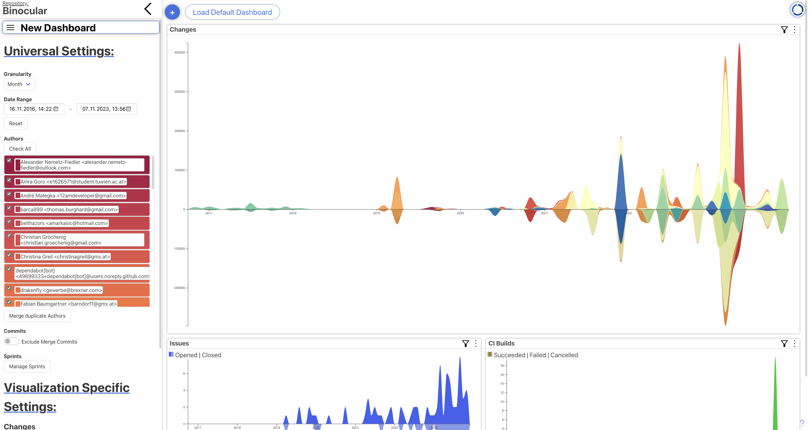

Preview
=====

https://github.com/INSO-TUWien/Binocular/assets/48351547/793fabf0-8007-447e-8a67-326dd1b881f0

## Dashboard

## Visualizations
### Changes
Additions/Deletions:

Commits:

### Issues

### CI Builds

### Issue Impact

### Distribution Dials

### Code Hotspots
Changes:

Change Hunks:

Developer:

Issues:

### Issue Breakdown

### Sprints

### Code Expertise

### Code Ownership
Absolute:

Realative:

## Export

